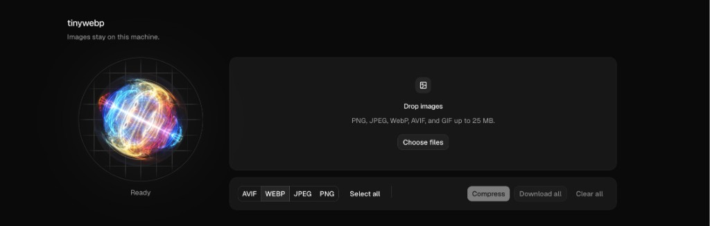

# tinywebp

Images stay on this machine.



Local image compressor. Drop files, pick output formats, hit Compress. Encoding runs through [sharp](https://sharp.pixelplumbing.com/) on this computer.

## Run

```bash
pnpm install
pnpm dev
```

Open [http://localhost:3000](http://localhost:3000).

## Use

1. Drop or choose images (PNG, JPEG, WebP, AVIF, GIF, TIFF, or HEIC). Up to 20 files, 25 MB each.
2. Select one or more output formats.
3. Compress. Download a file from the table, or Download all.

Clear all empties the queue.

## Formats

Output: AVIF, WebP, JPEG (MozJPEG), and PNG (palette). JPEG XL is not available in sharp’s default binaries.
